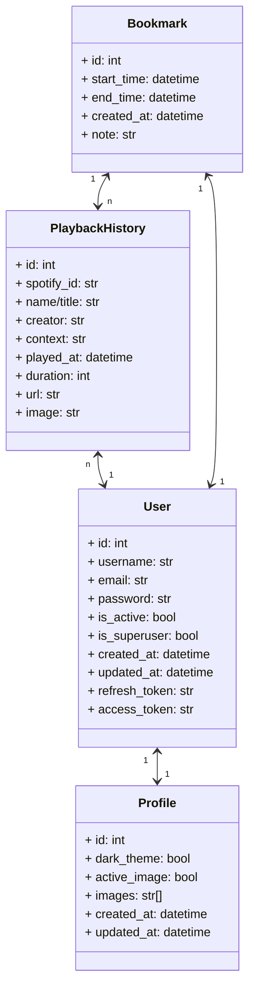

# Fast API Server

Serves the backend for the spotify player

# Models

```mermaid
classDiagram
    User "1" <--> "1" Profile

    PlaybackHistory "n" <--> "1" User

    Bookmark "1" <--> "n" PlaybackHistory
    Bookmark "1" <--> "1" User
    class User {
        + id: int
        + username: str
        + email: str
        + password: str
        + is_active: bool
        + is_superuser: bool
        + created_at: datetime
        + updated_at: datetime
        + refresh_token: str
        + access_token: str
    }

    class Profile {
        + id: int
        + dark_theme: bool
        + active_image: bool
        + images: str[]
        + created_at: datetime
        + updated_at: datetime

    }

    class PlaybackHistory {
        + id: int
        + spotify_id: str
        + name/title: str
        + creator: str
        + context: str
        + played_at: datetime
        + duration: int
        + url: str
        + image: str
    }
    
    class Bookmark {
        + id: int
        + start_time: datetime
        + end_time: datetime
        + created_at: datetime
        + note: str

    }

```

> [!NOTE]
> Consider about the `timestamp`s. Maybe create `Triggers` and define defaults
